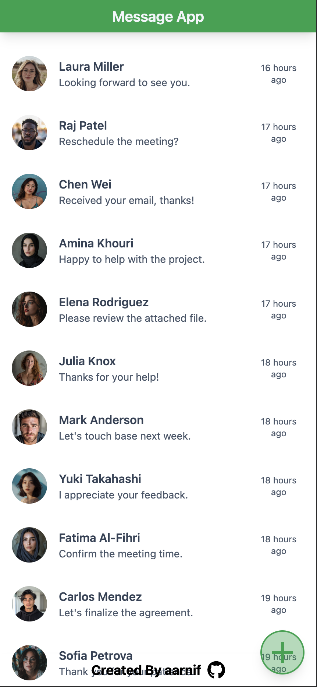

# Mobile Menu

This is a mobile menu example built with HTML, Tailwind CSS and JavaScript.
The project is part of the [The Odin Project's](https://www.theodinproject.com/) Full Stack JavaScript Course.

## Features

- User can show/hide the menu by pressing menu-button.

## Live Preview

[MOBILE MENU](https://aarnif.github.io/odin-drop-down-menu/)

## Technologies

- HTML
- Tailwind CSS
- JavaScript
- ChatGPT 4 (Profiles)
- Midjourney (Profile images)

## Image


Image of the project.

## Instructions

```
HTTPS - git clone https://github.com/aarnif/odin-mobile-menu.git

SSH - git clone git@github.com:aarnif/odin-mobile-menu.git

cd odin-mobile-menu

npm install

npm run dev # For development

npm run build # For production
```
